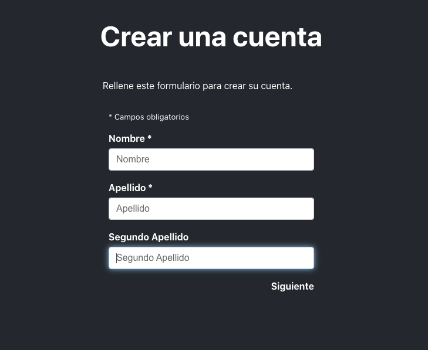
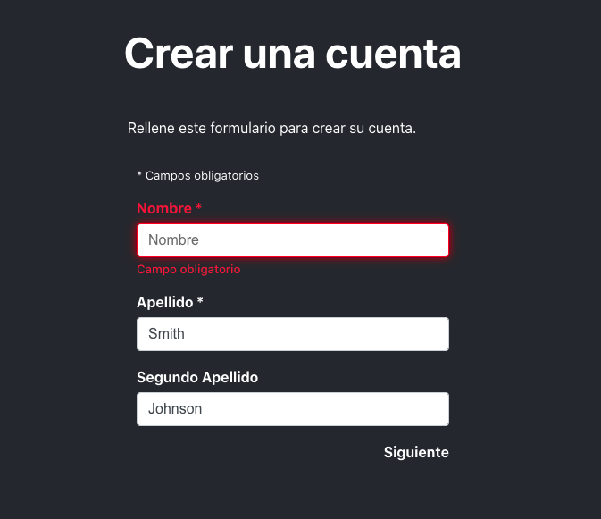
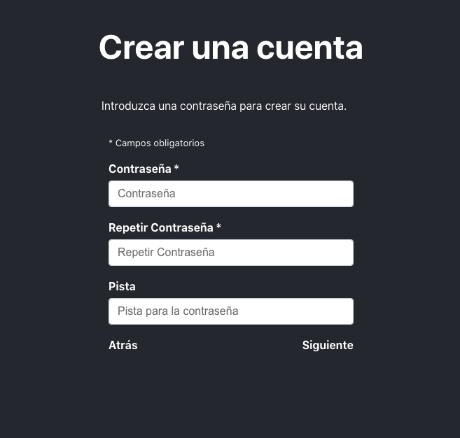
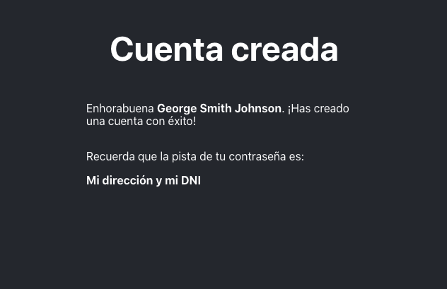

# Bienvenid@ al test de Napptilus (FE)

  

## Introducción

  

Esta prueba está diseñada para evaluar las capacidades técnicas, concretamente en el area de React y Single Page Applications(SPA). Con esta prueba se valorará aspectos de arquitectura, maquetación y la programación. 

## ¿Cómo entregar la prueba?  

Haz un fork de este repositorio y empieza a trabajar en la prueba. Cuando lo hagas, añade **visual-matthew** a tu repositorio.

## Requerimientos

 - Utilizar Redux & React Router
 - Implementar traducciones para cada texto. (i18n)
 - Tiene que estar maquetada correctamente
 - Se puede renombrar, quitar o añadir cualquier fichero
 - Crear todos los componentes desde 0 (no utilizar librerías)
 - Reutilización de componentes
 - Buena estructura del proyecto
 - Desarrollar esta aplicación con el máximo rendimiento.

  

##  Objetivo

¡Vamos a crear un formulario! Esta aplicación estará dividida en 3 páginas. En la primera página, el usuario rellenará un nombre, un apellido y un segundo apellido (opcional). La segunda página, el usuario tendrá que rellenar una contraseña, repetir la contraseña y finalmente una pista (opcional). La última página será una página de confirmación. **Todos los textos deben estar en inglés y español (i18n)**

## Primera página

La primera página debe contener el título **Crear una cuenta** y la descripción:
**Rellene este formulario para crear su cuenta.**

En esta página, tenemos que pedir al usuario que rellene **nombre**, **apellido** y **segundo apellido.** 
####  Validación

 - Las 3 entradas del formulario deben mostrar un error al introducir un número
 - El **nombre** y el **apellido** son obligatorios. El **segundo apellido no es obligatorio**
 - No se puede avanzar si uno de los campos obligatorios no estén rellenados/válidos.

(Cómo mostrar los errores)
  

## Segunda página

La segunda página debe contener el título **Crear una cuenta** y la descripción:
**Introduzca una contraseña para crear su cuenta**

En esta página, tenemos que pedir al usuario que rellene **contraseña**, **repetir contraseña** y **una pista** 
####  Validación
 - Path tiene que ser /set-password.
 - Si intento acceder a /set-password a través de la URL sin rellenar la primera página del formulario, tengo que ser redirigido a la primera página
 - Contraseña y Repetir Contraseña tienen que ser iguales.
 - **Contraseña** y **Repetir Contraseña** son obligatorios. La **pista no es obligatorio**
 - La contraseña debe tener más de 5 caracteres, al menos un número y una letra mayúscula.
 - En caso de que el usuario rellene la pista, hay que validar que el campo no contenga la contraseña, y que tenga una longitud máxima de 20 caracteres y mínima 5 caracteres.
 - No se puede avanzar si uno de los campos obligatorios no estén rellenados/válidos.

## Tercera página

La tercera página debe contener el título **Cuenta creada** y la descripción:
**Enhorabuena {Nombre completo de la persona}. ¡Has creado una cuenta con éxito!**

Esta página no tendrá campos pero tendrás que mostrar un mensaje recordando al usuario su pista en caso de que haya rellenado una pista de contraseña.
####  Validación
 - Path tiene que ser /success.
 - Si intento acceder a /success a través de la URL sin rellenar todo el formulario, debo ser redirigido a la primera página.
 - Mostrar el recordatorio de contraseña en caso de que el usuario haya rellenado una pista de contraseña.
